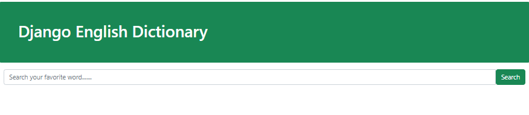
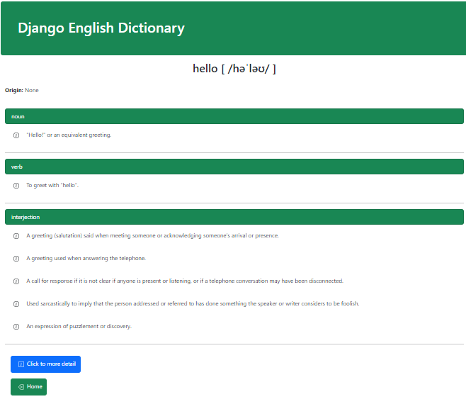

# Django Dictionary App

> This Django application is a simple English dictionary that allows users to explore the meanings of words, using [Dictionary API](https://dictionaryapi.dev/)

# Demo:

## Homepage



## Product page



## Installation:

**1.Clone the Repo**

```sh
git clone https://github.com/Kaiyrtay/Django-Dictionary.git
```

**2.Setup pipenv & Install Requirements**

```sh
pip install pipenv
pipenv install -r requirements.txt
pipenv shell
```

**3.Start Server**

```sh
python manage.py runserver
```

# End

> Good luck!
